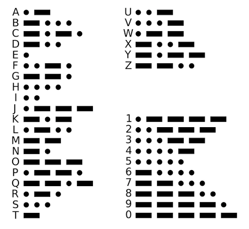

# WinkCode: An Eye Blink to Morse Code Decoder Pipeline

WinkCode is a project that translates eye blinks into Morse code and then decodes it into text. This system uses computer vision techniques to detect eye blinks in real-time video, interprets them as Morse code signals, and converts them into readable text.




## Features

- Real-time eye blink detection using facial landmarks
- Conversion of eye blinks to Morse code (dots and dashes)
- Morse code to text translation
- Live video feed with visual feedback
- Adjustable parameters for blink detection and timing

## Requirements

This project requires Python 3.x and the following libraries:

- opencv-python
- dlib
- imutils
- keyboard
- numpy

You can install the required packages using the provided `requirements.txt` file:

```pip install -r requirements.txt```

## Usage

1. Clone this repository
2. Install the required dependencies
3. Download the shape predictor file (`shape_predictor_68_face_landmarks.dat`) and place it in the project directory
4. Run the main script
5. Face the camera and start blinking to input Morse code:
   - Short blink for a dot (.)
   - Long blink for a dash (-)
   - Pause between characters
   - Longer pause for word separation
6. The decoded text will be displayed and typed automatically

## How It Works

1. The system detects facial landmarks using dlib
2. Eye aspect ratio (EAR) is calculated to determine if eyes are open or closed
3. Blink duration is used to differentiate between dots and dashes
4. The resulting Morse code is translated into text
5. Output is displayed on screen and typed automatically

## Configuration

You can adjust various parameters in the `constants.py` file to fine-tune the system's behavior:

- `EYE_AR_THRESH`: Threshold for considering eyes closed
- `EYE_AR_CONSEC_FRAMES`: Consecutive frames for dot detection
- `EYE_AR_CONSEC_FRAMES_CLOSED`: Consecutive frames for dash detection
- `PAUSE_CONSEC_FRAMES`: Frames to detect character separation
- `WORD_PAUSE_CONSEC_FRAMES`: Frames to detect word separation
- `BREAK_LOOP_FRAMES`: Frames to end the program

## Performance

We've conducted tests to measure the accuracy of the system using Levenshtein distance. The results are available in the attached CSV file. However, this was not measured extensively.

## Contributing

Contributions to WinkCode are welcome! Please feel free to submit a Pull Request.

## Acknowledgements

This project was inspired by and builds upon the work of others in the field of computer vision and eye-tracking:

- [Rob McElhinney's Blink-Morse project](https://github.com/robmcelhinney/blink-morse): This repository provided valuable insights into the implementation of Morse code translation from eye blinks.

- [PyImageSearch's Eye Blink Detection tutorial](https://pyimagesearch.com/2017/04/24/eye-blink-detection-opencv-python-dlib): Adrian Rosebrock's tutorial on eye blink detection using OpenCV and dlib was instrumental in developing the eye tracking system.
